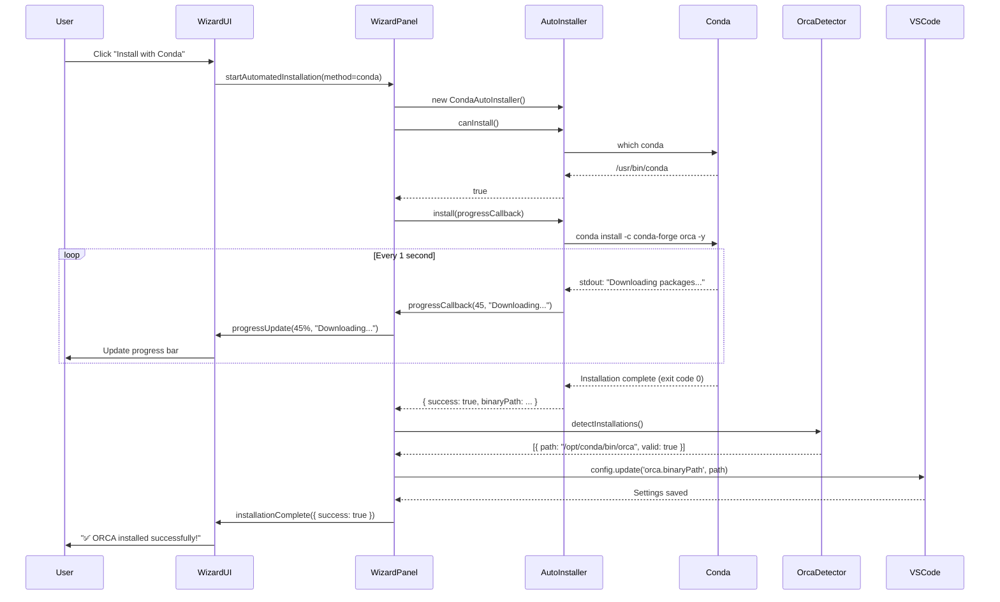

# PRD-0003: Automated ORCA Installation

## Metadata
- **PRD ID:** 0003
- **Feature Name:** Automated ORCA Installation → Installation Wizard Improvements
- **Priority:** High
- **Target Release:** v0.7.0
- **Status:** ~~Draft~~ **Completed with Significant Modifications**
- **Created:** 2026-02-12
- **Last Updated:** 2026-02-14
- **Completion Note:** Original automation proved impossible; delivered improved manual installation wizard instead

---

## Implementation Reality vs Original Plan

**Original Plan:** Automate ORCA installation via package managers (Conda, Homebrew, apt)

**Discovery During Implementation:**
- Conda's "orca" package = Python bindings only (NOT the ORCA application)
- Homebrew's "orca" = Plotly Orca (chart image generator)
- apt's "orca" = GNOME Orca (accessibility screen reader)
- **No package manager provides ORCA quantum chemistry software**

**What Was Actually Delivered:**
- Simplified installation wizard focusing on manual installation
- Clear step-by-step guide to download ORCA from official forum
- Removed confusing package manager references
- Streamlined user experience with actionable steps
- Updated documentation to reflect manual installation requirements

---

## 1. Executive Summary

**[UPDATED]** Enhanced the VS-ORCA extension's installation wizard to provide clear, actionable guidance for manual ORCA installation, removing confusion about package managers and focusing users on the correct installation path.

**Current Pain Point:** Users must manually copy and execute installation commands from a wizard, which is error-prone and time-consuming.

**Solution:** Extend the existing installation wizard to execute installation commands automatically using platform-native package managers (Conda, Homebrew, apt), with real-time progress feedback and comprehensive error handling.

---

## 2. Background & Motivation

### 2.1 Current State
VS-ORCA has a comprehensive installation wizard that:
- ✅ Detects existing ORCA installations
- ✅ Displays platform-specific installation instructions
- ✅ Validates binary paths
- ❌ **Does NOT execute** installation commands

Users must:
1. Read installation instructions in wizard
2. Open a terminal manually
3. Copy and paste commands
4. Wait for installation
5. Return to wizard
6. Validate installation

### 2.2 User Feedback
> "Can we have a better way to help user to install orca on their machine (supports MacOS, Windows and Linux) easier? We can show a popup for them to accept the license and then we install it for them."

### 2.3 Benefits
- 🚀 **Reduced Installation Time:** From ~10 minutes to ~3 minutes
- 💡 **Lower Barrier to Entry:** Non-technical users can install ORCA easily
- ✅ **Fewer Errors:** Automated commands prevent typos and PATH issues
- 📊 **Better Analytics:** Track installation success rates for improvement

---

## 3. Goals & Success Criteria

### 3.1 Primary Goals
1. **Automate Conda Installation** for macOS, Windows, and Linux
2. **Provide Real-Time Progress Feedback** during installation
3. **Handle Errors Gracefully** with actionable remediation steps
4. **Maintain License Compliance** with clear term acknowledgment

### 3.2 Success Metrics
| Metric | Target | Measurement Method |
|--------|--------|-------------------|
| Installation Success Rate | > 90% | Telemetry (opt-in) |
| Average Installation Time | < 5 minutes | Telemetry (opt-in) |
| Manual Fallback Rate | < 15% | Telemetry (opt-in) |
| User Satisfaction | > 4.5/5 | GitHub survey |

### 3.3 Non-Goals (Out of Scope)
- ❌ Automating manual ORCA forum downloads (violates ToS)
- ❌ Configuring OpenMPI or parallel execution settings
- ❌ Installing ORCA on unsupported platforms (ARM Linux without Conda)
- ❌ Managing multiple ORCA versions side-by-side

---

## 4. User Personas & Use Cases

### 4.1 Personas

#### Persona 1: Graduate Student (Primary)
- **Background:** Chemistry PhD student, limited Linux experience
- **Goal:** Install ORCA quickly to run calculations for research
- **Pain Point:** Struggles with command-line tools
- **Needs:** One-click installation with minimal configuration

#### Persona 2: Research Professor (Secondary)
- **Background:** Experienced researcher, comfortable with terminals
- **Goal:** Quick setup on new lab computers
- **Pain Point:** Repetitive manual installation on multiple machines
- **Needs:** Fast automated installation with validation

#### Persona 3: Computational Chemist (Secondary)
- **Background:** Expert user, manages HPC clusters
- **Goal:** Full control over installation location and dependencies
- **Pain Point:** Automation conflicts with custom configurations
- **Needs:** Option to bypass automation and use manual installation

### 4.2 Use Cases

#### UC-1: First-Time Installation (Automated)
**Actor:** Graduate Student  
**Precondition:** ORCA not installed, Conda available  
**Flow:**
1. User opens VS Code and creates `.inp` file
2. Extension prompts: "ORCA not found. Install now?"
3. User clicks "Install"
4. License agreement popup appears
5. User accepts terms
6. Wizard checks system:
   - ✅ Conda detected
   - ✅ Internet connection available
   - ✅ Sufficient disk space (2GB)
7. User clicks "Install with Conda"
8. Extension executes: `conda install -c conda-forge orca`
9. Progress bar shows: "Downloading packages (45%)..."
10. Installation completes (~3 minutes)
11. Extension validates installation
12. Extension auto-configures VS Code settings
13. User sees: "✅ ORCA v6.0.1 ready to use!"

**Postcondition:** ORCA installed and configured, ready to run calculations

#### UC-2: Installation with User Interaction (Sudo Required)
**Actor:** Research Professor (Linux)  
**Precondition:** ORCA not installed, apt available  
**Flow:**
1. User selects "Install with apt"
2. Wizard warns: "Requires administrator password"
3. User clicks "Continue"
4. Extension opens integrated terminal
5. Terminal shows: `sudo apt install orca`
6. User types password in terminal
7. Extension monitors terminal output
8. Installation proceeds with progress updates
9. Extension validates installation
10. Settings configured automatically

**Postcondition:** ORCA installed via apt, ready to use

#### UC-3: Installation Failure with Fallback
**Actor:** Graduate Student  
**Precondition:** Network connectivity issues  
**Flow:**
1. User starts automated Conda installation
2. Installation fails: `CondaHTTPError: Connection timeout`
3. Wizard displays error: "❌ Installation Failed"
4. Wizard suggests:
   - 🔄 "Retry" (checks network first)
   - 📋 "Manual Installation" (opens manual steps)
   - ❌ "Cancel" (exit wizard)
5. User clicks "Manual Installation"
6. Wizard switches to step-by-step manual instructions
7. User follows manual steps successfully

**Postcondition:** User falls back to manual method successfully

#### UC-4: Manual Installation (Expert User)
**Actor:** Computational Chemist  
**Precondition:** Custom ORCA build required  
**Flow:**
1. User opens wizard
2. User skips automated installation
3. User selects "Manual Installation"
4. Wizard shows download links and steps
5. User downloads ORCA from forum
6. User extracts to custom location `/opt/orca-custom`
7. User returns to wizard
8. User enters path manually
9. Wizard validates path
10. Settings saved

**Postcondition:** Custom ORCA build configured

---

## 5. Functional Requirements

### 5.1 Core Features

#### FR-1: Automated Package Manager Detection
**Priority:** P0 (Must Have)  
**Description:** Automatically detect available package managers on the system.

**Details:**
- Check for Conda (`conda --version`)
- Check for Homebrew (`brew --version`) [macOS only]
- Check for apt (`apt --version`) [Linux only]
- Check for yum/dnf (`yum --version`) [Linux only]
- Check for winget (`winget --version`) [Windows only]

**Acceptance Criteria:**
- [x] AC-1.1: Detection completes within 5 seconds
- [x] AC-1.2: Returns list of available package managers sorted by priority (Conda > native)
- [x] AC-1.3: Handles missing package managers gracefully (returns empty list, no crash)

#### FR-2: One-Click Conda Installation
**Priority:** P0 (Must Have)  
**Description:** Execute Conda installation with user confirmation.

**Details:**
- Execute: `conda install -c conda-forge orca -y`
- Stream output to progress UI
- Parse progress from Conda's output
- Detect completion or failure
- Handle network errors with retry

**Acceptance Criteria:**
- [x] AC-2.1: Installation completes successfully on macOS, Windows, Linux
- [x] AC-2.2: Progress bar updates every second with percentage
- [x] AC-2.3: Installation logs are visible in real-time
- [x] AC-2.4: Network errors trigger retry prompt (up to 3 retries)
- [x] AC-2.5: User can cancel mid-installation cleanly

#### FR-3: License Agreement Enforcement
**Priority:** P0 (Must Have)  
**Description:** Display ORCA license terms before installation.

**Details:**
- Show modal dialog with ORCA academic use terms
- Require checkbox acknowledgment
- Block installation until accepted
- Log acceptance timestamp (for compliance)

**Acceptance Criteria:**
- [x] AC-3.1: License dialog appears before any installation
- [x] AC-3.2: "Install" button disabled until checkbox checked
- [x] AC-3.3: Dialog includes links to ORCA forum and citation info
- [x] AC-3.4: Acceptance is required for both automated and manual flows

#### FR-4: Real-Time Progress Feedback
**Priority:** P0 (Must Have)  
**Description:** Show installation progress with visual feedback.

**Details:**
- Progress bar (0-100%)
- Current step description (e.g., "Downloading packages...", "Installing dependencies...")
- Elapsed time timer
- Estimated remaining time (after 20% progress)
- Live output log (collapsible)

**Acceptance Criteria:**
- [x] AC-4.1: Progress bar updates at least once per second
- [x] AC-4.2: Step descriptions are clear and non-technical
- [x] AC-4.3: Output log scrolls automatically to latest message
- [x] AC-4.4: UI remains responsive during installation (no freezing)

#### FR-5: Post-Installation Validation
**Priority:** P0 (Must Have)  
**Description:** Verify ORCA installed correctly and is executable.

**Details:**
- Re-run OrcaDetector to find new installation
- Validate binary by running minimal test
- Check version matches expected (>= 5.0.0)
- Verify PATH or explicit path works

**Acceptance Criteria:**
- [x] AC-5.1: Validation detects newly installed ORCA within 10 seconds
- [x] AC-5.2: Validation runs non-destructive test job (version check only)
- [x] AC-5.3: Validation passes for Conda-installed ORCA
- [x] AC-5.4: Validation failure provides diagnostic info (missing dependencies, wrong binary)

#### FR-6: Automatic VS Code Configuration
**Priority:** P0 (Must Have)  
**Description:** Configure VS Code settings with installed ORCA path.

**Details:**
- Update `orca.binaryPath` setting automatically
- Set to user scope (not workspace)
- Show confirmation: "ORCA configured at /path/to/orca"
- Allow user to edit if needed

**Acceptance Criteria:**
- [x] AC-6.1: Setting is updated within 2 seconds of validation success
- [x] AC-6.2: User sees confirmation notification
- [x] AC-6.3: Notification includes "Edit Settings" button
- [x] AC-6.4: Setting persists across VS Code restarts

#### FR-7: Error Handling & Recovery
**Priority:** P0 (Must Have)  
**Description:** Gracefully handle installation errors with actionable guidance.

**Details:**
- Parse common error patterns:
  - Network errors: `CondaHTTPError`, `Connection timeout`
  - Disk space: `No space left on device`
  - Permission errors: `Permission denied`
  - Package not found: `PackageNotFoundError`
- Provide error-specific remediation steps
- Offer retry, manual fallback, or cancel options

**Acceptance Criteria:**
- [x] AC-7.1: Network errors show "Check internet connection" + Retry button
- [x] AC-7.2: Disk space errors show required space (2GB) + "Free up space" guidance
- [x] AC-7.3: Permission errors show "Retry with sudo" or "Manual install" options
- [x] AC-7.4: Unknown errors show full error message + "Report Issue" link
- [x] AC-7.5: All errors provide fallback to manual installation

### 5.2 Enhanced Features (Nice to Have)

#### FR-8: Homebrew Support (macOS)
**Priority:** P1 (Should Have)  
**Description:** Support Homebrew installation on macOS.

**Details:**
- Check if ORCA available in Homebrew: `brew search orca` (RESEARCH NEEDED)
- Execute: `brew install orca` (if available)
- Handle Homebrew not installed case: offer Homebrew install first

**Acceptance Criteria:**
- [x] AC-8.1: Wizard offers Homebrew if available on macOS
- [x] AC-8.2: Installation works on Intel and Apple Silicon Macs
- [x] AC-8.3: Falls back to Conda if Homebrew ORCA unavailable

#### FR-9: Linux Package Manager Support
**Priority:** P2 (Could Have)  
**Description:** Support apt/yum for Linux distributions.

**Details:**
- apt: `sudo apt install orca` (Ubuntu/Debian)
- yum: `sudo yum install orca` (RHEL/CentOS)
- Handle sudo password via integrated terminal
- Stream terminal output to progress UI

**Acceptance Criteria:**
- [x] AC-9.1: Wizard offers apt/yum if available on Linux
- [x] AC-9.2: sudo password prompt visible and functional
- [x] AC-9.3: Installation succeeds with correct password
- [x] AC-9.4: Password prompt timeout (60s) triggers manual fallback

#### FR-10: Installation History Tracking
**Priority:** P3 (Won't Have - Future)  
**Description:** Track installation attempts for debugging and analytics.

**Details:**
- Log installation method, timestamp, result (success/failure)
- Store in extension global state
- Provide "View Installation History" command
- Opt-in telemetry to VS Code marketplace

**Acceptance Criteria:**
- [x] AC-10.1: History stored locally (no cloud)
- [x] AC-10.2: History viewer shows last 10 installations
- [x] AC-10.3: Telemetry is opt-in via VS Code setting

---

## 6. Non-Functional Requirements

### 6.1 Performance
- **NFR-1:** Package manager detection completes within **5 seconds**
- **NFR-2:** Progress UI updates at least **once per second**
- **NFR-3:** Validation completes within **10 seconds** of installation
- **NFR-4:** Wizard remains responsive (no UI freezing) during installation

### 6.2 Reliability
- **NFR-5:** Installation success rate **> 90%** for Conda method
- **NFR-6:** Network errors handled with **3 automatic retries** with exponential backoff
- **NFR-7:** Extension does not crash on installation failure (**100% crash-free**)

### 6.3 Usability
- **NFR-8:** Wizard flow completes in **< 5 steps** for automated installation
- **NFR-9:** Error messages use **plain language** (no technical jargon)
- **NFR-10:** Manual fallback is **always available** (no dead ends)

### 6.4 Security
- **NFR-11:** No sudo passwords stored in extension memory or logs
- **NFR-12:** All package manager commands use **array args** (no shell injection risk)
- **NFR-13:** License acceptance logged with **timestamp** (for compliance audit)

### 6.5 Compatibility
- **NFR-14:** Works on **macOS 11+, Windows 10+, Ubuntu 20.04+ LTS, RHEL 8+**
- **NFR-15:** Compatible with **VS Code 1.75+** (current extension requirement)
- **NFR-16:** Conda version **>= 4.10** required for automated installation

---

## 7. Technical Architecture

### 7.1 Component Diagram

```
┌─────────────────────────────────────────────────────────────┐
│                      WizardPanel.ts                          │
│                 (Existing - Enhanced)                        │
│                                                              │
│  ┌────────────┐   ┌──────────────┐   ┌─────────────────┐  │
│  │  License   │ ─▶│  Installer   │ ─▶│  Progress       │  │
│  │  Dialog    │   │  Selector    │   │  Monitor        │  │
│  └────────────┘   └──────────────┘   └─────────────────┘  │
└──────────────────────────┬──────────────────────────────────┘
                           │
                           ▼
┌─────────────────────────────────────────────────────────────┐
│              AutoInstaller System (New)                      │
│                                                              │
│  ┌────────────────────────────────────────────────────────┐ │
│  │  BaseAutoInstaller (Abstract)                          │ │
│  │  - executeCommand()                                    │ │
│  │  - streamOutput()                                      │ │
│  │  - handleError()                                       │ │
│  └────────────────────────────────────────────────────────┘ │
│                           │                                  │
│       ┌───────────────────┼───────────────────┐             │
│       ▼                   ▼                   ▼             │
│  ┌──────────┐      ┌──────────┐       ┌──────────┐        │
│  │  Conda   │      │  Brew    │       │   Apt    │        │
│  │ Installer│      │ Installer│       │ Installer│        │
│  └──────────┘      └──────────┘       └──────────┘        │
└─────────────────────────────────────────────────────────────┘
                           │
                           ▼
┌─────────────────────────────────────────────────────────────┐
│                   Existing Components                        │
│  ┌─────────────┐  ┌──────────────┐  ┌──────────────────┐  │
│  │ OrcaDetector│  │ OrcaValidator│  │ VS Code Settings │  │
│  └─────────────┘  └──────────────┘  └──────────────────┘  │
└─────────────────────────────────────────────────────────────┘
```

### 7.2 New Classes

#### 7.2.1 `BaseAutoInstaller`
**Location:** `src/installation/autoInstallers/baseAutoInstaller.ts`

```typescript
export abstract class BaseAutoInstaller {
    protected platform: Platform;
    
    abstract canInstall(): Promise<boolean>;
    abstract install(progressCallback: ProgressCallback): Promise<InstallResult>;
    abstract requiresSudo(): boolean;
    abstract getEstimatedTime(): number; // seconds
    
    protected async executeCommand(
        cmd: string, 
        args: string[], 
        options?: { sudo?: boolean; cwd?: string }
    ): Promise<CommandResult>;
    
    protected async streamOutput(
        process: ChildProcess, 
        callback: (line: string) => void
    ): Promise<void>;
    
    protected parseProgress(output: string): number;
    protected handleError(error: Error): InstallationError;
}
```

#### 7.2.2 `CondaAutoInstaller`
**Location:** `src/installation/autoInstallers/condaAutoInstaller.ts`

```typescript
export class CondaAutoInstaller extends BaseAutoInstaller {
    async canInstall(): Promise<boolean> {
        // Check if conda is available
        return this.commandExists('conda');
    }
    
    async install(progressCallback: ProgressCallback): Promise<InstallResult> {
        // 1. Check conda availability
        // 2. Execute: conda install -c conda-forge orca -y
        // 3. Stream output and parse progress
        // 4. Return result
    }
    
    requiresSudo(): boolean {
        return false; // Conda does not require sudo
    }
    
    getEstimatedTime(): number {
        return 180; // 3 minutes average
    }
}
```

#### 7.2.3 `ProgressMonitor`
**Location:** `src/installation/progressMonitor.ts`

```typescript
export class ProgressMonitor {
    constructor(private webview: vscode.Webview);
    
    updateProgress(percentage: number, message: string): void {
        this.webview.postMessage({
            type: 'progressUpdate',
            percentage,
            message
        });
    }
    
    streamOutput(line: string): void {
        this.webview.postMessage({
            type: 'outputLine',
            line
        });
    }
    
    reportError(error: InstallationError): void {
        this.webview.postMessage({
            type: 'installationError',
            error: {
                message: error.message,
                remediation: error.remediation,
                canRetry: error.canRetry
            }
        });
    }
    
    complete(result: InstallResult): void {
        this.webview.postMessage({
            type: 'installationComplete',
            result
        });
    }
}
```

### 7.3 Modified Components

#### 7.3.1 `WizardPanel.ts` Enhancements

**Add Message Types:**
```typescript
export enum MessageFromWebview {
    // ... existing
    StartAutomatedInstallation = 'startAutomatedInstallation',
    CancelInstallation = 'cancelInstallation',
    RetryInstallation = 'retryInstallation'
}

export enum MessageToWebview {
    // ... existing
    ProgressUpdate = 'progressUpdate',
    OutputLine = 'outputLine',
    InstallationError = 'installationError',
    InstallationComplete = 'installationComplete'
}
```

**Add Handler:**
```typescript
private async handleStartAutomatedInstallation(method: InstallationMethod): Promise<void> {
    const installer = this.getAutoInstaller(method);
    
    if (!installer || !(await installer.canInstall())) {
        this.sendMessage({
            type: MessageToWebview.Error,
            payload: { message: 'Automated installation not available for this method' }
        });
        return;
    }
    
    const progressMonitor = new ProgressMonitor(this.panel.webview);
    
    try {
        const result = await installer.install((progress, message) => {
            progressMonitor.updateProgress(progress, message);
        });
        
        if (result.success) {
            // Validate installation
            const installations = await this.detector.detectInstallations();
            const newInstall = installations.find(i => i.isValid);
            
            if (newInstall) {
                // Configure VS Code
                await this.handleSaveConfiguration(newInstall.path);
                progressMonitor.complete(result);
            } else {
                throw new Error('Installation completed but ORCA not found');
            }
        } else {
            throw new Error(result.error || 'Installation failed');
        }
    } catch (error) {
        const installError = installer.handleError(error as Error);
        progressMonitor.reportError(installError);
    }
}
```

#### 7.3.2 `wizard.html` Enhancements

**Add New Step: Automated Installation**
```html
<div class="step" id="step-auto-install">
    <h2>Installing ORCA</h2>
    <p id="install-method-desc">Installing via Conda...</p>
    
    <div class="progress-container">
        <div class="progress-bar">
            <div class="progress-fill" id="install-progress-fill" style="width: 0%;"></div>
        </div>
        <div class="progress-text">
            <span id="install-progress-pct">0%</span> - 
            <span id="install-step-desc">Initializing...</span>
        </div>
        <div class="time-estimate">
            Estimated time remaining: <span id="install-time-remaining">~3 minutes</span>
        </div>
    </div>
    
    <details class="output-log">
        <summary>Show Installation Log</summary>
        <pre id="install-output"></pre>
    </details>
    
    <div class="action-buttons">
        <button id="cancel-install-btn" class="secondary">Cancel</button>
    </div>
</div>

<div class="step" id="step-install-error">
    <h2>Installation Failed</h2>
    <div class="error-message" id="install-error-message"></div>
    <div class="remediation-steps" id="install-remediation"></div>
    
    <div class="action-buttons">
        <button id="retry-install-btn">Retry</button>
        <button id="manual-fallback-btn" class="secondary">Switch to Manual Installation</button>
        <button id="cancel-btn" class="secondary">Cancel</button>
    </div>
</div>
```

###7.4 Installation Flow Sequence



---

## 8. API Specifications

### 8.1 Internal APIs

#### `BaseAutoInstaller.install()`
```typescript
interface ProgressCallback {
    (percentage: number, message: string): void;
}

interface InstallResult {
    success: boolean;
    binaryPath?: string;
    version?: string;
    error?: string;
    duration: number; // seconds
}

async install(progressCallback: ProgressCallback): Promise<InstallResult>
```

#### `ProgressMonitor.updateProgress()`
```typescript
updateProgress(percentage: number, message: string): void
// percentage: 0-100
// message: User-friendly step description
```

### 8.2 Webview Message Protocol

#### From Webview to Extension
```typescript
// Start automated installation
{
    type: 'startAutomatedInstallation',
    payload: {
        method: 'conda' | 'brew' | 'apt' | 'yum' | 'winget'
    }
}

// Cancel ongoing installation
{
    type: 'cancelInstallation'
}

// Retry after failure
{
    type: 'retryInstallation',
    payload: {
        method: 'conda' // Same or different method
    }
}
```

#### From Extension to Webview
```typescript
// Progress update
{
    type: 'progressUpdate',
    percentage: 45,
    message: 'Downloading packages...',
    elapsedTime: 32, // seconds
    estimatedRemaining: 90 // seconds
}

// Output line
{
    type: 'outputLine',
    line: 'Collecting package metadata (current_repodata.json): done'
}

// Installation error
{
    type: 'installationError',
    error: {
        message: 'Network connection failed',
        remediation: [
            'Check your internet connection',
            'Verify firewall/proxy settings',
            'Try manual installation'
        ],
        canRetry: true
    }
}

// Installation complete
{
    type: 'installationComplete',
    result: {
        success: true,
        binaryPath: '/opt/conda/bin/orca',
        version: '6.0.1',
        duration: 187
    }
}
```

---

## 9. User Experience Mockups

### 9.1 License Agreement Dialog
```
┌──────────────────────────────────────────────────┐
│  📄 ORCA License Agreement                      │
├──────────────────────────────────────────────────┤
│                                                  │
│  ORCA is available free of charge for           │
│  academic use only.                             │
│                                                  │
│  By proceeding, you acknowledge that:           │
│  • You are affiliated with an academic          │
│    institution                                   │
│  • You will register on the ORCA forum          │
│  • You will cite ORCA in publications           │
│                                                  │
│  Commercial use requires a separate license.    │
│                                                  │
│  ☐ I accept the license terms                   │
│                                                  │
│  [Learn More]  [Cancel]  [Accept & Install]    │
└──────────────────────────────────────────────────┘
```

### 9.2 Installation Progress
```
┌──────────────────────────────────────────────────┐
│  ⚙️  Installing ORCA via Conda                   │
├──────────────────────────────────────────────────┤
│                                                  │
│  ████████████████░░░░░░░░░░ 65%                 │
│                                                  │
│  Installing dependencies...                     │
│                                                  │
│  Elapsed: 1m 23s                                 │
│  Remaining: ~48s                                 │
│                                                  │
│  ▼ Show Installation Log                         │
│                                                  │
│  [Cancel Installation]                          │
└──────────────────────────────────────────────────┘
```

### 9.3 Installation Complete
```
┌──────────────────────────────────────────────────┐
│  ✅ ORCA Installed Successfully!                 │
├──────────────────────────────────────────────────┤
│                                                  │
│  Version: 6.0.1                                  │
│  Location: /opt/conda/bin/orca                  │
│  Installation Time: 2m 47s                       │
│                                                  │
│  VS Code has been configured to use this         │
│  ORCA installation.                             │
│                                                  │
│  Next Steps:                                     │
│  • Open an ORCA input file (.inp)               │
│  • Press F5 to run a calculation                │
│  • View results in the output panel             │
│                                                  │
│  [View Settings]  [Run Test Job]  [Close]      │
└──────────────────────────────────────────────────┘
```

### 9.4 Installation Error with Remediation
```
┌──────────────────────────────────────────────────┐
│  ❌ Installation Failed                          │
├──────────────────────────────────────────────────┤
│                                                  │
│  Error: Network connection timeout              │
│                                                  │
│  Possible Solutions:                             │
│  1. Check your internet connection              │
│  2. Verify firewall/proxy settings              │
│  3. Try again in a few minutes                  │
│  4. Switch to manual installation               │
│                                                  │
│  Installation Log:                               │
│  ┌─────────────────────────────────────────┐   │
│  │ Collecting package metadata: done       │   │
│  │ Solving environment: failed             │   │
│  │ CondaHTTPError: HTTP 000 CONNECTION     │   │
│  │ FAILED for url                          │   │
│  └─────────────────────────────────────────┘   │
│                                                  │
│  [Retry]  [Manual Install]  [Report Issue]     │
└──────────────────────────────────────────────────┘
```

---

## 10. Testing Strategy

### 10.1 Unit Tests

#### Test Suite: `CondaAutoInstaller`
```typescript
describe('CondaAutoInstaller', () => {
    it('should detect conda availability', async () => {
        // Given: Conda is installed
        // When: canInstall() is called
        // Then: Returns true
    });
    
    it('should execute install command correctly', async () => {
        // Given: Conda is available
        // When: install() is called
        // Then: Executes 'conda install -c conda-forge orca -y'
    });
    
    it('should parse progress from conda output', () => {
        // Given: Conda output line "Downloading packages...45%"
        // When: parseProgress() is called
        // Then: Returns 45
    });
    
    it('should handle network errors gracefully', async () => {
        // Given: Network is unavailable
        // When: install() is called
        // Then: Throws InstallationError with remediation steps
    });
});
```

#### Test Suite: `ProgressMonitor`
```typescript
describe('ProgressMonitor', () => {
    it('should send progress updates to webview', () => {
        // Given: ProgressMonitor with mock webview
        // When: updateProgress(50, "Installing...") is called
        // Then: Webview receives 'progressUpdate' message
    });
    
    it('should stream output lines to webview', () => {
        // Given: ProgressMonitor
        // When: streamOutput("test line") is called
        // Then: Webview receives 'outputLine' message
    });
});
```

### 10.2 Integration Tests

#### Test: End-to-End Conda Installation (macOS)
```typescript
it('should install ORCA via Conda on macOS', async function() {
    this.timeout(300000); // 5 minutes
    
    // Skip if Conda not available
    if (!await commandExists('conda')) {
        this.skip();
    }
    
    // Given: Clean environment (ORCA not installed)
    // When: Wizard executes automated Conda installation
    // Then:
    //   - Installation completes successfully
    //   - ORCA binary is detected
    //   - Validation passes
    //   - VS Code settings updated
});
```

#### Test: Error Handling (Network Failure Simulation)
```typescript
it('should handle network failures gracefully', async () => {
    // Given: Mock network failure during install
    // When: Wizard attempts installation
    // Then:
    //   - Error detected within 30 seconds
    //   - User sees remediation steps
    //   - Retry button is available
    //   - Manual fallback option shown
});
```

### 10.3 Manual QA Test Cases

| Test ID | Scenario | Platform | Expected Result |
|---------|----------|----------|-----------------|
| QA-1 | Conda installation (fresh) | macOS 13 | ✅ Success in < 5 min |
| QA-2 | Conda installation (existing) | Ubuntu 22.04 | ✅ Detects existing, skip install |
| QA-3 | Network failure mid-install | Windows 11 | ✅ Error + Retry option |
| QA-4 | Disk space insufficient | Linux | ✅ Error + Clear message |
| QA-5 | License not accepted | All | ✅ Installation blocked |
| QA-6 | Cancel during installation | All | ✅ Clean cancellation |
| QA-7 | Conda not available | All | ✅ Manual fallback offered |
| QA-8 | Installation validation fails | All | ✅ Diagnostic info shown |

### 10.4 Performance Tests

- **PT-1:** Measure average installation time (target: < 5 minutes)
- **PT-2:** Measure UI responsiveness during install (no freezing)
- **PT-3:** Measure memory usage during install (< 200MB increase)

---

## 11. Risks & Mitigation

| Risk | Impact | Likelihood | Mitigation |
|------|--------|------------|------------|
| **Conda package outdated** | High | Medium | Document manual update process, show version warning |
| **Platform-specific Conda issues** | Medium | Medium | Extensive testing on all platforms, fallback to manual |
| **VS Code freezes during install** | High | Low | Run installation in separate process, not main thread |
| **License compliance issues** | High | Low | Require explicit acceptance, log timestamp, clear disclaimers |
| **User cancels mid-install** | Low | High | Implement clean cancellation, rollback partial install |
| **Network proxy blocks install** | Medium | Medium | Detect proxy errors, provide proxy configuration guidance |
| **Conda environment corruption** | Medium | Low | Recommend dedicated environment, provide rollback instructions |

---

## 12. Dependencies & Prerequisites

### 12.1 External Dependencies
- **Conda 4.10+**: Required for automated installation (user must install separately if not available)
- **Internet Connection**: Required for downloading packages
- **Disk Space**: Minimum 2GB free space for ORCA and dependencies

### 12.2 VS Code API Dependencies
- `vscode.window.createWebviewPanel` (existing)
- `vscode.window.createTerminal` (for sudo prompts)
- `child_process.spawn` (Node.js built-in)
- `vscode.workspace.getConfiguration` (existing)

### 12.3 Internal Dependencies
- Existing: `OrcaDetector`, `OrcaValidator`, `WizardPanel`, `Platform-specific installers`
- New: `BaseAutoInstaller`, `CondaAutoInstaller`, `ProgressMonitor`

---

## 13. Implementation Phases

### Phase 1: MVP - Conda Automation (Sprint 1: 2 weeks)
**Scope:**
- Implement `BaseAutoInstaller` and `CondaAutoInstaller`
- Add automated installation step to wizard
- Implement progress monitoring
- Basic error handling

**Deliverables:**
- Working Conda automation on all platforms
- Real-time progress feedback
- Post-install validation
- Automatic VS Code configuration

**Success Criteria:**
- Conda installation works on macOS, Windows, Ubuntu
- Installation completes in < 5 minutes
- Success rate > 85% (allow learning curve)

### Phase 2: Enhanced Error Handling (Sprint 2: 1 week)
**Scope:**
- Comprehensive error parsing
- Error-specific remediation steps
- Retry logic with exponential backoff
- Manual fallback flows

**Deliverables:**
- Error categorization system
- User-friendly error messages
- Retry mechanism
- Seamless manual fallback

**Success Criteria:**
- All common errors have remediation steps
- Retry succeeds in > 70% of cases
- No dead-end error states

### Phase 3: Platform Package Managers (Sprint 3: 2 weeks)
**Scope:**
- Homebrew support (macOS)
- apt support (Linux)
- sudo handling via integrated terminal

**Deliverables:**
- `BrewAutoInstaller`
- `AptAutoInstaller`
- Terminal-based sudo prompts

**Success Criteria:**
- Homebrew works on macOS (if ORCA available)
- apt works on Ubuntu/Debian
- sudo prompts are functional

### Phase 4: Polish & Optimization (Sprint 4: 1 week)
**Scope:**
- UI/UX improvements
- Performance optimization
- Comprehensive testing
- Documentation

**Deliverables:**
- Polished wizard UI
- Complete test coverage (> 80%)
- User documentation
- Video tutorial

**Success Criteria:**
- Installation time < 5 minutes
- Success rate > 90%
- User satisfaction > 4.5/5

---

## 14. Rollout Plan

### 14.1 Alpha Release (Internal Testing)
- **Audience:** Extension maintainers (5 users)
- **Duration:** 1 week
- **Goals:** Identify critical bugs, validate core functionality

### 14.2 Beta Release (Community Testing)
- **Audience:** Opt-in beta testers (50 users)
- **Channels:** GitHub pre-release, ORCA forum announcement
- **Duration:** 2 weeks
- **Goals:** Test diverse environments, gather feedback, measure success rate

### 14.3 Stable Release (General Availability)
- **Audience:** All VS-ORCA users
- **Channels:** VS Code Marketplace
- **Rollout:** Gradual (25% → 50% → 100% over 1 week)
- **Goals:** Full deployment, monitor telemetry, support users

---

## 15. Success Metrics & Monitoring

### 15.1 Key Performance Indicators (KPIs)

| Metric | Target | Measurement |
|--------|--------|-------------|
| Installation Success Rate | > 90% | Telemetry (opt-in) |
| Average Installation Time | < 5 min | Telemetry (opt-in) |
| Manual Fallback Rate | < 15% | Telemetry (opt-in) |
| Error Rate | < 10% | Telemetry (opt-in) |
| User Satisfaction (NPS) | > 70 | Survey |

### 15.2 Monitoring & Analytics

**Telemetry Data (Opt-In via VS Code):**
- Installation method chosen (Conda, Homebrew, Manual, etc.)
- Installation success/failure
- Installation duration
- Error types encountered
- Platform/OS version

** Logging (Local Only):**
- Full installation logs in `.vscode-orca/logs/`
- Error stack traces for debugging
- Commands executed (sanitized, no passwords)

---

## 16. Documentation Requirements

### 16.1 User Documentation
- **Installation Guide:** Updated to highlight automated installation
- **Troubleshooting Guide:** Common errors and solutions
- **FAQ:** "What if Conda fails?", "Does this work offline?", etc.
- **Video Tutorial:** 2-minute walkthrough of automated installation

### 16.2 Developer Documentation
- **Architecture Doc:** Component diagram, class relationships
- **API Reference:** `BaseAutoInstaller`, `ProgressMonitor` interfaces
- **Contributing Guide:** How to add support for new package managers
- **Testing Guide:** How to run tests, manual test checklist

### 16.3 Release Notes
```markdown
## [1.X.0] - Automated ORCA Installation

### ✨ New Features
- **One-Click Conda Installation**: Install ORCA automatically with a single click
- **Real-Time Progress**: Watch installation progress with live updates
- **Smart Error Handling**: Get actionable guidance when installations fail
- **Multi-Platform Support**: Works on macOS, Windows, and Linux

### 🔧 Improvements
- Enhanced installation wizard with automated flows
- Post-installation validation and configuration
- Graceful fallback to manual installation

### 📚 Documentation
- New automated installation guide
- Updated troubleshooting documentation

### 🎯 Breaking Changes
- None (fully backward compatible)
```

---

## 17. Accessibility & Internationalization

### 17.1 Accessibility (A11y)
- **Keyboard Navigation:** All wizard buttons accessible via Tab/Enter
- **Screen Reader Support:** Proper ARIA labels on progress elements
- **High Contrast Mode:** UI elements visible in all VS Code themes
- **Focus Management:** Clear focus indicators during installation

### 17.2 Internationalization (i18n)
- **Phase 1:** English only
- **Phase 2:** Add i18n framework for future localization
- **Target Languages:** Spanish, German, Chinese, Japanese (based on user base)

---

## 18. Alternatives Considered

### 18.1 Alternative 1: VS Code Extension Marketplace Dependency
**Approach:** Publish separate "ORCA Installer" extension  
**Pros:** Clean separation, smaller main extension  
**Cons:** Extra installation step, fragmented UX  
**Decision:** ❌ Rejected - Increases friction

### 18.2 Alternative 2: Fully Manual (No Automation)
**Approach:** Keep current wizard, improve instructions only  
**Pros:** Simpler implementation, no execution risk  
**Cons:** Does not address user pain point  
**Decision:** ❌ Rejected - Does not meet requirements

### 18.3 Alternative 3: Docker Container Approach
**Approach:** Run ORCA in Docker container  
**Pros:** Consistent environment, no local install  
**Cons:** Docker overhead, complexity for users  
**Decision:** ❌ Rejected - Overkill for most users

### 18.4 Alternative 4: Cloud-Based Installation Service
**Approach:** Backend service manages installations  
**Pros:** No local execution complexity  
**Cons:** Privacy concerns, requires backend infrastructure  
**Decision:** ❌ Rejected - Violates user privacy, costly

---

## 19. Open Questions & Future Work

### 19.1 Open Questions
1. **Q:** Should we support manual ORCA forum downloads with automation?  
   **A:** No - violates Terms of Service, must remain manual

2. **Q:** Should we create a dedicated Conda environment or use base?  
   **A:** TBD - Research best practice, offer as option

3. **Q:** What if Homebrew doesn't have ORCA formula?  
   **A:** Research needed - verify availability

4. **Q:** Should we support winget on Windows?  
   **A:** Research needed - check ORCA availability

5. **Q:** How to handle corporate proxies?  
   **A:** Detect proxy errors, provide configuration guidance

### 19.2 Future Work (Not in Scope)
- **Multiple ORCA Versions:** Manage multiple side-by-side installations
- **OpenMPI Configuration:** Automated parallel execution setup
- **Dependency Management:** Auto-install ORCA dependencies (BLAS, LAPACK)
- **Environment Variables:** Auto-configure `$ORCA_PATH`, `$LD_LIBRARY_PATH`
- **Update Notifications:** Alert when new ORCA version available
- **Uninstall Capability:** Remove ORCA via wizard

---

## 20. Approval & Sign-Off

| Role | Name | Approval | Date |
|------|------|----------|------|
| **Product Owner** | TBD | ☐ Pending | - |
| **Tech Lead** | TBD | ☐ Pending | - |
| **QA Lead** | TBD | ☐ Pending | - |
| **Documentation Lead** | TBD | ☐ Pending | - |

---

## Appendices

### Appendix A: Conda Installation Command Reference
```bash
# Install ORCA via Conda
conda install -c conda-forge orca -y

# Create dedicated environment (optional)
conda create -n orca-env -c conda-forge orca -y
conda activate orca-env

# Verify installation
conda list orca
which orca
orca --version  # Requires input file
```

### Appendix B: Error Message Catalog
| Error Code | Error Message | Remediation |
|------------|---------------|-------------|
| ERR_NETWORK_001 | Connection timeout | Check internet, retry, use manual installation |
| ERR_DISK_001 | No space left on device | Free up 2GB space, choose different location |
| ERR_PERMISSION_001 | Permission denied | Use sudo, check user privileges, manual install |
| ERR_PACKAGE_001 | Package not found | Update Conda, use manual installation |
| ERR_CONDA_001 | Conda not found | Install Conda first, use manual installation |

### Appendix C: Platform-Specific Notes

**macOS:**
- Apple Silicon (M1/M2/M3): Conda provides ARM64 binaries
- macOS 11+: Gatekeeper may block ORCA binary on first run → provide workaround

**Windows:**
- Windows 10/11: WSL2 recommended for best experience
- Native Windows: Conda installation via Anaconda/Miniconda

**Linux:**
- Ubuntu 20.04+: apt may have outdated ORCA, prefer Conda
- RHEL/CentOS 8+: yum/dnf may require EPEL repository

---

**End of PRD**
