# ORCA Installation Capability - Task Breakdown

**Feature**: ORCA Installation Capability  
**PRD**: `docs/PRD-ORCA-Installation-Capability.md`  
**Created**: December 20, 2025  
**Status**: Planning  
**Priority**: High

---

## Overview

This document provides a complete task breakdown for implementing the ORCA Installation Capability feature as specified in the PRD. The implementation follows a 4-phase approach with clear dependencies and sequencing.

**Success Criteria**:

- Reduce installation-related support requests by 80%
- Increase successful first-run rate from 30% to 90%
- Reduce time-to-first-successful-job from 45min to <10min
- 95% of users complete setup without external documentation

---

## Task Hierarchy

```
ORCA Installation Capability (Parent)
│
├── Phase 1: Detection & Validation Foundation (Week 1)
│   ├── TASK-001: Project Structure Setup
│   ├── TASK-002: ORCA Detector Module
│   ├── TASK-003: ORCA Validator Module
│   ├── TASK-004: Version Parser Implementation
│   ├── TASK-005: Detection Unit Tests
│   ├── TASK-006: Validation Unit Tests
│   └── TASK-007: Integration with runJob Command
│
├── Phase 2: OS-Specific Installation Strategies (Week 2)
│   ├── TASK-008: Base Installation Strategy Interface
│   ├── TASK-009: Linux Installation Strategy
│   ├── TASK-010: macOS Installation Strategy
│   ├── TASK-011: Windows Installation Strategy
│   ├── TASK-012: Conda Installation Support
│   ├── TASK-013: License Compliance UI
│   ├── TASK-014: Prerequisite Checker
│   ├── TASK-015: Installation Strategy Tests
│   └── TASK-016: Cross-Platform Manual Testing
│
├── Phase 3: Installation Wizard UI (Week 3)
│   ├── TASK-017: Wizard Webview Panel Setup
│   ├── TASK-018: Wizard HTML Template
│   ├── TASK-019: Wizard Step Navigation
│   ├── TASK-020: License Acknowledgment Step
│   ├── TASK-021: Detection Step Integration
│   ├── TASK-022: Installation Instructions Step
│   ├── TASK-023: Path Configuration Step
│   ├── TASK-024: Validation Step
│   ├── TASK-025: Wizard State Persistence
│   ├── TASK-026: Copy-to-Clipboard Functionality
│   ├── TASK-027: Wizard Styling & Polish
│   └── TASK-028: Wizard End-to-End Tests
│
├── Phase 4: Commands & Integration (Week 4)
│   ├── TASK-029: Setup ORCA Command
│   ├── TASK-030: Detect ORCA Command
│   ├── TASK-031: Validate ORCA Command
│   ├── TASK-032: Diagnose ORCA Command
│   ├── TASK-033: Status Bar Integration
│   ├── TASK-034: Configuration Schema Updates
│   ├── TASK-035: Health Check on Startup
│   ├── TASK-036: Multi-Version Support
│   ├── TASK-037: Documentation Updates
│   ├── TASK-038: Integration Testing
│   └── TASK-039: Final QA & Polish
│
└── Post-Implementation
    ├── TASK-040: Performance Optimization
    ├── TASK-041: Telemetry Integration (Optional)
    └── TASK-042: User Acceptance Testing

```

---

## Phase 1: Detection & Validation Foundation (Week 1)

**Goal**: Build core detection and validation capabilities that can identify ORCA installations and verify their functionality.

**Estimated Effort**: 18-22 hours

### TASK-001: Project Structure Setup

**Priority**: P0 (Blocker)  
**Effort**: 1 hour  
**Dependencies**: None  
**Details**: [tasks-details/TASK-001.md](../tasks-details/TASK-001.md)

**Deliverables**:

- Create `src/installation/` directory structure
- Create `src/installation/strategies/` directory
- Create `src/installation/wizard/` directory
- Add TypeScript interfaces file: `src/installation/types.ts`
- Update `tsconfig.json` with new paths if needed

**Acceptance Criteria**:

- ✅ All directories created and visible in workspace
- ✅ Project compiles without errors
- ✅ Git structure properly organized

---

### TASK-002: ORCA Detector Module

**Priority**: P0 (Must Have)  
**Effort**: 4-5 hours  
**Dependencies**: TASK-001  
**Details**: [tasks-details/TASK-002.md](../tasks-details/TASK-002.md)

**Deliverables**:

- `src/installation/detector.ts` with `OrcaDetector` class
- Detection algorithm for all 3 OSes (Linux, macOS, Windows)
- Environment variable scanning (`$PATH`, `$ORCA_PATH`, `$ORCA_HOME`)
- Conda environment detection
- Standard directory scanning
- Multiple installation handling

**Acceptance Criteria**:

- ✅ Detects ORCA in standard locations within 2 seconds
- ✅ Handles missing installations gracefully
- ✅ Returns sorted list (latest version first)
- ✅ No false positives for non-ORCA binaries

---

### TASK-003: ORCA Validator Module

**Priority**: P0 (Must Have)  
**Effort**: 4-5 hours  
**Dependencies**: TASK-001  
**Details**: [tasks-details/TASK-003.md](../tasks-details/TASK-003.md)

**Deliverables**:

- `src/installation/validator.ts` with `OrcaValidator` class
- Binary validation logic (existence, permissions, executability)
- Test job execution in extension storage directory
- Dependency checker (OpenMPI, MPI, libraries)
- Comprehensive health check method

**Acceptance Criteria**:

- ✅ Validates binary in <1 second (excluding test job)
- ✅ Test job completes in <30 seconds
- ✅ Cleans up test files after execution
- ✅ Returns structured validation results

---

### TASK-004: Version Parser Implementation

**Priority**: P0 (Must Have)  
**Effort**: 2-3 hours  
**Dependencies**: TASK-002  
**Details**: [tasks-details/TASK-004.md](../tasks-details/TASK-004.md)

**Deliverables**:

- Version extraction from stderr banner (ORCA 4.x-5.x behavior)
- Regex pattern: `/Program Version (\d+\.\d+\.\d+)/`
- Version comparison logic
- Minimum version validation (4.0+)
- Handle version parsing failures gracefully

**Acceptance Criteria**:

- ✅ Correctly parses versions from ORCA 4.0 to 6.0
- ✅ Handles stderr output (not stdout)
- ✅ Returns null for unparseable output
- ✅ Timeout set to 5 seconds

---

### TASK-005: Detection Unit Tests

**Priority**: P0 (Must Have)  
**Effort**: 3-4 hours  
**Dependencies**: TASK-002, TASK-004  
**Details**: [tasks-details/TASK-005.md](../tasks-details/TASK-005.md)

**Deliverables**:

- `src/test/suite/detector.test.ts`
- Mock file system for path scanning
- Mock spawn for version detection
- Test cases for all 3 OSes
- Edge cases: missing binary, corrupt binary, multiple versions

**Acceptance Criteria**:

- ✅ 80%+ code coverage for detector.ts
- ✅ All tests passing
- ✅ Tests run in <5 seconds
- ✅ No external dependencies (fully mocked)

---

### TASK-006: Validation Unit Tests

**Priority**: P0 (Must Have)  
**Effort**: 3-4 hours  
**Dependencies**: TASK-003  
**Details**: [tasks-details/TASK-006.md](../tasks-details/TASK-006.md)

**Deliverables**:

- `src/test/suite/validator.test.ts`
- Mock ORCA binary (shell script returning test output)
- Test job execution mocking
- Dependency checker tests
- Edge cases: hung processes, invalid output

**Acceptance Criteria**:

- ✅ 80%+ code coverage for validator.ts
- ✅ All tests passing
- ✅ Tests complete in <10 seconds
- ✅ Mock binary behaves like real ORCA

---

### TASK-007: Integration with runJob Command

**Priority**: P0 (Must Have)  
**Effort**: 2-3 hours  
**Dependencies**: TASK-002, TASK-003  
**Details**: [tasks-details/TASK-007.md](../tasks-details/TASK-007.md)

**Deliverables**:

- Modify `src/extension.ts` to use detector on binary path failure
- Show detection results to user with action buttons
- Launch wizard if no installation found
- Automatic configuration if installation detected

**Acceptance Criteria**:

- ✅ Seamless integration with existing runJob flow
- ✅ No breaking changes to current functionality
- ✅ Clear user prompts with actionable options
- ✅ Settings updated automatically when user accepts detected path

---

## Phase 2: OS-Specific Installation Strategies (Week 2)

**Goal**: Implement OS-specific installation guidance and strategy classes.

**Estimated Effort**: 24-28 hours

### TASK-008: Base Installation Strategy Interface

**Priority**: P0 (Must Have)  
**Effort**: 2 hours  
**Dependencies**: TASK-001  
**Details**: [tasks-details/TASK-008.md](../tasks-details/TASK-008.md)

**Deliverables**:

- `src/installation/strategies/base.ts` with interfaces
- `InstallationStrategy` interface
- `InstallationStep` interface
- `Prerequisite` interface
- Abstract base class implementation

**Acceptance Criteria**:

- ✅ Clean interface design
- ✅ Supports all installation methods (Conda, manual, package manager)
- ✅ Extensible for future OS support

---

### TASK-009: Linux Installation Strategy

**Priority**: P0 (Must Have)  
**Effort**: 5-6 hours  
**Dependencies**: TASK-008  
**Details**: [tasks-details/TASK-009.md](../tasks-details/TASK-009.md)

**Deliverables**:

- `src/installation/strategies/linuxInstaller.ts`
- Distro detection from `/etc/os-release`
- Conda installation instructions (primary)
- AUR support for Arch Linux (`yay -S orca`)
- Manual tarball download instructions
- PATH configuration commands (display only, no execution)
- Dependency checking (OpenMPI, GCC, Python)

**Acceptance Criteria**:

- ✅ Detects Ubuntu, Debian, Fedora, CentOS, Arch, openSUSE
- ✅ Provides copyable terminal commands
- ✅ No automatic shell config modification
- ✅ Includes security warnings

---

### TASK-010: macOS Installation Strategy

**Priority**: P0 (Must Have)  
**Effort**: 5-6 hours  
**Dependencies**: TASK-008  
**Details**: [tasks-details/TASK-010.md](../tasks-details/TASK-010.md)

**Deliverables**:

- `src/installation/strategies/macosInstaller.ts`
- Homebrew detection (`which brew`)
- Conda installation instructions (primary)
- Intel vs. Apple Silicon detection
- Manual download instructions
- PATH configuration for zsh/bash (display only)
- Gatekeeper workaround instructions

**Acceptance Criteria**:

- ✅ Correctly identifies Apple Silicon vs. Intel
- ✅ Provides Homebrew link if not installed
- ✅ Shows appropriate PATH commands for user's shell
- ✅ No automatic Homebrew installation

---

### TASK-011: Windows Installation Strategy

**Priority**: P0 (Must Have)  
**Effort**: 5-6 hours  
**Dependencies**: TASK-008  
**Details**: [tasks-details/TASK-011.md](../tasks-details/TASK-011.md)

**Deliverables**:

- `src/installation/strategies/windowsInstaller.ts`
- Direct download link to ORCA website
- ZIP extraction instructions
- PATH configuration via Environment Variables UI
- `setx` command alternative
- Visual C++ Redistributable check
- WSL2 alternative guidance

**Acceptance Criteria**:

- ✅ Step-by-step Windows-specific instructions
- ✅ Links to VC++ Redistributable installer
- ✅ WSL2 setup guide
- ✅ PATH configuration options clearly explained

---

### TASK-012: Conda Installation Support

**Priority**: P0 (Must Have)  
**Effort**: 3-4 hours  
**Dependencies**: TASK-009, TASK-010, TASK-011  
**Details**: [tasks-details/TASK-012.md](../tasks-details/TASK-012.md)

**Deliverables**:

- Conda detection logic (`which conda`)
- Conda installation link (if missing)
- ORCA installation via `conda install -c conda-forge orca`
- Conda environment path detection in detector module
- Verification command: `conda list orca`

**Acceptance Criteria**:

- ✅ Detects Conda/Miniconda/Anaconda
- ✅ Recommends Conda as primary method for all OSes
- ✅ Explains benefits (auto-dependency management, no PATH issues)
- ✅ Integration with detector for Conda environment scanning

---

### TASK-013: License Compliance UI

**Priority**: P0 (Must Have)  
**Effort**: 2-3 hours  
**Dependencies**: TASK-008  
**Details**: [tasks-details/TASK-013.md](../tasks-details/TASK-013.md)

**Deliverables**:

- License disclaimer component
- Academic use only notice
- Required acknowledgment checkbox
- Citation information (WIREs paper)
- BibTeX format for citations
- ORCA forum registration link
- Commercial licensing information

**Acceptance Criteria**:

- ✅ Users cannot proceed without acknowledgment
- ✅ Clear language about academic license restrictions
- ✅ Citation information easily copyable
- ✅ Links to ORCA forum and licensing pages

---

### TASK-014: Prerequisite Checker

**Priority**: P1 (Should Have)  
**Effort**: 3-4 hours  
**Dependencies**: TASK-008  
**Details**: [tasks-details/TASK-014.md](../tasks-details/TASK-014.md)

**Deliverables**:

- Prerequisite checking logic
- Dependency detection (OpenMPI, MPI, BLAS, GCC)
- Disk space validation
- Admin rights check (for system-wide installation)
- Missing prerequisite warnings

**Acceptance Criteria**:

- ✅ Checks all prerequisites in <2 seconds
- ✅ Provides installation commands for missing dependencies
- ✅ Non-blocking warnings (user can proceed anyway)
- ✅ OS-specific prerequisite lists

---

### TASK-015: Installation Strategy Tests

**Priority**: P0 (Must Have)  
**Effort**: 3-4 hours  
**Dependencies**: TASK-009, TASK-010, TASK-011  
**Details**: [tasks-details/TASK-015.md](../tasks-details/TASK-015.md)

**Deliverables**:

- `src/test/suite/installers.test.ts`
- Test instruction generation for each OS
- Mock distro detection
- Test prerequisite checking
- Validate command correctness

**Acceptance Criteria**:

- ✅ 80%+ code coverage for all installer strategies
- ✅ All tests passing
- ✅ Validates instruction accuracy
- ✅ Tests complete in <5 seconds

---

### TASK-016: Cross-Platform Manual Testing

**Priority**: P0 (Must Have)  
**Effort**: 4-5 hours  
**Dependencies**: TASK-009, TASK-010, TASK-011  
**Details**: [tasks-details/TASK-016.md](../tasks-details/TASK-016.md)

**Deliverables**:

- Test on Ubuntu/Debian VM
- Test on macOS (Intel and Apple Silicon if available)
- Test on Windows 10/11
- Verify instructions on each platform
- Document platform-specific issues

**Acceptance Criteria**:

- ✅ Instructions tested on all 3 major OSes
- ✅ All commands verified as correct
- ✅ Edge cases documented
- ✅ Test report with screenshots

---

## Phase 3: Installation Wizard UI (Week 3)

**Goal**: Build interactive webview wizard for guided installation.

**Estimated Effort**: 28-32 hours

### TASK-017: Wizard Webview Panel Setup

**Priority**: P0 (Must Have)  
**Effort**: 3-4 hours  
**Dependencies**: TASK-001  
**Details**: [tasks-details/TASK-017.md](../tasks-details/TASK-017.md)

**Deliverables**:

- `src/installation/wizard/wizardPanel.ts`
- Webview panel creation and lifecycle management
- Message passing protocol (extension ↔ webview)
- Panel disposal and cleanup
- Singleton pattern (only one wizard at a time)

**Acceptance Criteria**:

- ✅ Wizard opens in new panel
- ✅ Panel properly disposed on close
- ✅ Prevents multiple instances
- ✅ Message passing works bidirectionally

---

### TASK-018: Wizard HTML Template

**Priority**: P0 (Must Have)  
**Effort**: 4-5 hours  
**Dependencies**: TASK-017  
**Details**: [tasks-details/TASK-018.md](../tasks-details/TASK-018.md)

**Deliverables**:

- `src/installation/wizard/wizard.html`
- HTML structure for 7-step wizard
- Progress indicator UI
- Step containers with transitions
- VS Code styling (CSS variables)
- JavaScript for client-side logic

**Acceptance Criteria**:

- ✅ Matches VS Code theme (dark/light)
- ✅ Responsive layout
- ✅ Accessible (keyboard navigation)
- ✅ Smooth step transitions

---

### TASK-019: Wizard Step Navigation

**Priority**: P0 (Must Have)  
**Effort**: 3-4 hours  
**Dependencies**: TASK-017, TASK-018  
**Details**: [tasks-details/TASK-019.md](../tasks-details/TASK-019.md)

**Deliverables**:

- Step navigation logic (Next, Back, Skip)
- Progress bar updates
- Step validation before advancement
- Navigation button state management
- URL fragment for step tracking

**Acceptance Criteria**:

- ✅ Can navigate forward/backward
- ✅ Progress bar reflects current step
- ✅ Cannot advance past invalid steps
- ✅ Skip option available on appropriate steps

---

### TASK-020: License Acknowledgment Step

**Priority**: P0 (Must Have)  
**Effort**: 2-3 hours  
**Dependencies**: TASK-013, TASK-019  
**Details**: [tasks-details/TASK-020.md](../tasks-details/TASK-020.md)

**Deliverables**:

- License step UI (Step 2)
- Academic license disclaimer text
- Required acknowledgment checkbox
- Citation information display
- Next button disabled until checked

**Acceptance Criteria**:

- ✅ Checkbox must be checked to proceed
- ✅ License text clearly visible
- ✅ Citation information copyable
- ✅ State persisted across wizard sessions

---

### TASK-021: Detection Step Integration

**Priority**: P0 (Must Have)  
**Effort**: 3-4 hours  
**Dependencies**: TASK-002, TASK-019  
**Details**: [tasks-details/TASK-021.md](../tasks-details/TASK-021.md)

**Deliverables**:

- Detection step UI (Step 3)
- "Scanning..." loading indicator
- Display detected installations
- Selection UI for multiple installations
- "No installations found" state

**Acceptance Criteria**:

- ✅ Shows real-time detection progress
- ✅ Lists all detected installations
- ✅ Allows selection if multiple found
- ✅ Handles zero installations gracefully

---

### TASK-022: Installation Instructions Step

**Priority**: P0 (Must Have)  
**Effort**: 4-5 hours  
**Dependencies**: TASK-009, TASK-010, TASK-011, TASK-019  
**Details**: [tasks-details/TASK-022.md](../tasks-details/TASK-022.md)

**Deliverables**:

- Installation step UI (Step 4)
- OS detection and appropriate instructions display
- Tabbed interface (Conda / Manual / Package Manager)
- Code blocks with syntax highlighting
- Copy-to-clipboard buttons
- External links (ORCA download, Conda website)

**Acceptance Criteria**:

- ✅ Shows correct instructions for user's OS
- ✅ Tabs switch smoothly
- ✅ All commands copyable
- ✅ Links open in external browser

---

### TASK-023: Path Configuration Step

**Priority**: P0 (Must Have)  
**Effort**: 3-4 hours  
**Dependencies**: TASK-019  
**Details**: [tasks-details/TASK-023.md](../tasks-details/TASK-023.md)

**Deliverables**:

- Path configuration step UI (Step 5)
- Text input for binary path
- "Browse..." button (opens file picker)
- Re-run detection button
- Path validation (real-time)

**Acceptance Criteria**:

- ✅ Input accepts valid paths
- ✅ Browse dialog filters for executables
- ✅ Shows validation feedback immediately
- ✅ Can re-detect after installation

---

### TASK-024: Validation Step

**Priority**: P0 (Must Have)  
**Effort**: 3-4 hours  
**Dependencies**: TASK-003, TASK-019  
**Details**: [tasks-details/TASK-024.md](../tasks-details/TASK-024.md)

**Deliverables**:

- Validation step UI (Step 6)
- "Running test job..." loading state
- Test job progress indicator
- Validation results display (✅ ❌ ⚠️)
- Detailed error messages for failures

**Acceptance Criteria**:

- ✅ Shows real-time validation progress
- ✅ Displays test job output
- ✅ Clear success/failure indication
- ✅ Retry button on failure

---

### TASK-025: Wizard State Persistence

**Priority**: P0 (Must Have)  
**Effort**: 3-4 hours  
**Dependencies**: TASK-019  
**Details**: [tasks-details/TASK-025.md](../tasks-details/TASK-025.md)

**Deliverables**:

- State schema definition (`WizardState` interface)
- globalState API integration
- Save state on each step completion
- Resume wizard from saved state
- State expiration (7 days)
- "Reset Wizard" functionality

**Acceptance Criteria**:

- ✅ State persists across VS Code restarts
- ✅ Can resume wizard from last step
- ✅ Old states automatically cleaned up
- ✅ State cleared on successful completion

---

### TASK-026: Copy-to-Clipboard Functionality

**Priority**: P0 (Must Have)  
**Effort**: 2 hours  
**Dependencies**: TASK-022  
**Details**: [tasks-details/TASK-026.md](../tasks-details/TASK-026.md)

**Deliverables**:

- Copy button component
- Clipboard API integration
- Visual feedback on copy (checkmark icon)
- Fallback for clipboard API unavailable

**Acceptance Criteria**:

- ✅ Copies text to clipboard on click
- ✅ Shows "Copied!" confirmation
- ✅ Works on all supported platforms
- ✅ Handles clipboard permission errors

---

### TASK-027: Wizard Styling & Polish

**Priority**: P1 (Should Have)  
**Effort**: 3-4 hours  
**Dependencies**: TASK-018, TASK-019  
**Details**: [tasks-details/TASK-027.md](../tasks-details/TASK-027.md)

**Deliverables**:

- CSS polish and refinement
- Animations and transitions
- Responsive layout improvements
- Dark/light theme support
- Accessibility improvements (ARIA labels)

**Acceptance Criteria**:

- ✅ Looks professional and polished
- ✅ Matches VS Code design language
- ✅ Smooth animations
- ✅ Fully accessible (WCAG 2.1 AA)

---

### TASK-028: Wizard End-to-End Tests

**Priority**: P0 (Must Have)  
**Effort**: 4-5 hours  
**Dependencies**: TASK-017 through TASK-027  
**Details**: [tasks-details/TASK-028.md](../tasks-details/TASK-028.md)

**Deliverables**:

- `src/test/suite/wizard.test.ts`
- Test full wizard flow
- Mock webview interactions
- Test state persistence
- Test error handling

**Acceptance Criteria**:

- ✅ All wizard paths tested
- ✅ Tests pass consistently
- ✅ Edge cases covered
- ✅ Tests complete in <30 seconds

---

## Phase 4: Commands & Integration (Week 4)

**Goal**: Create commands, integrate with extension, and finalize feature.

**Estimated Effort**: 16-20 hours

### TASK-029: Setup ORCA Command

**Priority**: P0 (Must Have)  
**Effort**: 2 hours  
**Dependencies**: TASK-017  
**Details**: [tasks-details/TASK-029.md](../tasks-details/TASK-029.md)

**Deliverables**:

- Register `vs-orca.setupOrca` command
- Command launches installation wizard
- Add to Command Palette
- Keyboard shortcut (optional)

**Acceptance Criteria**:

- ✅ Command appears in Command Palette
- ✅ Launches wizard correctly
- ✅ Shows in extension commands list

---

### TASK-030: Detect ORCA Command

**Priority**: P0 (Must Have)  
**Effort**: 2 hours  
**Dependencies**: TASK-002  
**Details**: [tasks-details/TASK-030.md](../tasks-details/TASK-030.md)

**Deliverables**:

- Register `vs-orca.detectOrca` command
- Runs detection and shows results
- Offers to configure detected installation
- Shows notification with results

**Acceptance Criteria**:

- ✅ Displays all detected installations
- ✅ Shows version information
- ✅ Offers configuration action
- ✅ Handles no installations found

---

### TASK-031: Validate ORCA Command

**Priority**: P0 (Must Have)  
**Effort**: 2 hours  
**Dependencies**: TASK-003  
**Details**: [tasks-details/TASK-031.md](../tasks-details/TASK-031.md)

**Deliverables**:

- Register `vs-orca.validateOrca` command
- Runs full validation on configured binary
- Shows validation results
- Displays test job output

**Acceptance Criteria**:

- ✅ Validates current configuration
- ✅ Shows detailed results
- ✅ Includes actionable errors
- ✅ Offers to re-configure on failure

---

### TASK-032: Diagnose ORCA Command

**Priority**: P1 (Should Have)  
**Effort**: 3 hours  
**Dependencies**: TASK-002, TASK-003  
**Details**: [tasks-details/TASK-032.md](../tasks-details/TASK-032.md)

**Deliverables**:

- Register `vs-orca.diagnoseOrca` command
- Comprehensive diagnostics report
- Copy report to clipboard
- Includes: paths, environment vars, dependencies, test results

**Acceptance Criteria**:

- ✅ Generates complete diagnostic report
- ✅ Report copyable for support tickets
- ✅ Includes remediation suggestions
- ✅ Completes in <5 seconds

---

### TASK-033: Status Bar Integration

**Priority**: P1 (Should Have)  
**Effort**: 2-3 hours  
**Dependencies**: TASK-002  
**Details**: [tasks-details/TASK-033.md](../tasks-details/TASK-033.md)

**Deliverables**:

- Status bar item showing active ORCA version
- Click to show version selection menu
- Update on configuration change
- Show warning icon if installation invalid

**Acceptance Criteria**:

- ✅ Shows current ORCA version
- ✅ Clickable to open version selector
- ✅ Updates in real-time
- ✅ Shows appropriate icons

---

### TASK-034: Configuration Schema Updates

**Priority**: P0 (Must Have)  
**Effort**: 2 hours  
**Dependencies**: TASK-001  
**Details**: [tasks-details/TASK-034.md](../tasks-details/TASK-034.md)

**Deliverables**:

- Update `package.json` with new settings
- Add `orca.autoDetectOnStartup`
- Add `orca.installations` array
- Add `orca.installationWizardCompleted`
- Add `orca.licenseAcknowledged`

**Acceptance Criteria**:

- ✅ Settings appear in VS Code settings UI
- ✅ Default values appropriate
- ✅ Descriptions clear and helpful
- ✅ Schema validation works

---

### TASK-035: Health Check on Startup

**Priority**: P1 (Should Have)  
**Effort**: 2-3 hours  
**Dependencies**: TASK-002, TASK-003  
**Details**: [tasks-details/TASK-035.md](../tasks-details/TASK-035.md)

**Deliverables**:

- Run health check on extension activation
- Verify configured binary still exists
- Warn if installation broken
- Offer to re-configure or run wizard

**Acceptance Criteria**:

- ✅ Completes in <2 seconds
- ✅ Non-blocking (doesn't delay activation)
- ✅ Shows warning only if issues found
- ✅ Respects `autoDetectOnStartup` setting

---

### TASK-036: Multi-Version Support

**Priority**: P2 (Nice to Have)  
**Effort**: 3-4 hours  
**Dependencies**: TASK-002, TASK-033  
**Details**: [tasks-details/TASK-036.md](../tasks-details/TASK-036.md)

**Deliverables**:

- Store multiple installations in settings
- Quick-switch command
- Version selection menu
- Per-workspace version override

**Acceptance Criteria**:

- ✅ Can store multiple ORCA versions
- ✅ Switch via status bar or command
- ✅ Workspace settings override global
- ✅ Active version clearly indicated

---

### TASK-037: Documentation Updates

**Priority**: P0 (Must Have)  
**Effort**: 3-4 hours  
**Dependencies**: All Phase 4 tasks  
**Details**: [tasks-details/TASK-037.md](../tasks-details/TASK-037.md)

**Deliverables**:

- Update `README.md` with installation wizard info
- Update `QUICKSTART.md` with new onboarding flow
- Add `INSTALLATION.md` with detailed instructions
- Update screenshots
- Add GIF demos of wizard

**Acceptance Criteria**:

- ✅ All documentation reflects new feature
- ✅ Installation wizard prominently featured
- ✅ Screenshots/GIFs up to date
- ✅ Clear for first-time users

---

### TASK-038: Integration Testing

**Priority**: P0 (Must Have)  
**Effort**: 4-5 hours  
**Dependencies**: All previous tasks  
**Details**: [tasks-details/TASK-038.md](../tasks-details/TASK-038.md)

**Deliverables**:

- Create mock ORCA binary for tests
- Test full flow: detection → wizard → validation → job execution
- Test on fresh extension install
- Test with pre-existing configuration

**Acceptance Criteria**:

- ✅ End-to-end flow works seamlessly
- ✅ No regressions in existing functionality
- ✅ All error paths tested
- ✅ Tests automated where possible

---

### TASK-039: Final QA & Polish

**Priority**: P0 (Must Have)  
**Effort**: 3-4 hours  
**Dependencies**: TASK-038  
**Details**: [tasks-details/TASK-039.md](../tasks-details/TASK-039.md)

**Deliverables**:

- Fix any remaining bugs
- Polish UI/UX rough edges
- Performance optimization
- Final code review

**Acceptance Criteria**:

- ✅ All acceptance criteria met
- ✅ No known critical bugs
- ✅ Performance within targets
- ✅ Code review approved

---

## Post-Implementation Tasks

### TASK-040: Performance Optimization

**Priority**: P2 (Nice to Have)  
**Effort**: 2-3 hours  
**Dependencies**: TASK-039  
**Details**: [tasks-details/TASK-040.md](../tasks-details/TASK-040.md)

**Deliverables**:

- Profile detection performance
- Optimize file scanning
- Cache detection results
- Reduce startup overhead

**Acceptance Criteria**:

- ✅ Detection <2 seconds consistently
- ✅ No noticeable activation delay
- ✅ Memory usage reasonable

---

### TASK-041: Telemetry Integration (Optional)

**Priority**: P3 (Optional)  
**Effort**: 2-3 hours  
**Dependencies**: TASK-039  
**Details**: [tasks-details/TASK-041.md](../tasks-details/TASK-041.md)

**Deliverables**:

- Anonymous telemetry for wizard completion rate
- Installation success/failure metrics
- Opt-in consent mechanism

**Acceptance Criteria**:

- ✅ Fully anonymous data
- ✅ User consent required
- ✅ Can be disabled
- ✅ Privacy policy compliant

---

### TASK-042: User Acceptance Testing

**Priority**: P0 (Must Have)  
**Effort**: 4-5 hours  
**Dependencies**: TASK-039  
**Details**: [tasks-details/TASK-042.md](../tasks-details/TASK-042.md)

**Deliverables**:

- Recruit 5-10 beta testers
- Provide test scenarios
- Collect feedback
- Measure success metrics

**Acceptance Criteria**:

- ✅ 90%+ successful wizard completions
- ✅ Average time <10 minutes
- ✅ Positive user feedback
- ✅ No critical issues reported

---

## Dependencies Graph

```mermaid
graph TD
    T001[TASK-001: Structure] --> T002[TASK-002: Detector]
    T001 --> T003[TASK-003: Validator]
    T001 --> T008[TASK-008: Base Interface]

    T002 --> T004[TASK-004: Version Parser]
    T002 --> T005[TASK-005: Detector Tests]
    T002 --> T007[TASK-007: runJob Integration]
    T002 --> T021[TASK-021: Detection Step]
    T002 --> T030[TASK-030: Detect Command]
    T002 --> T033[TASK-033: Status Bar]
    T002 --> T035[TASK-035: Health Check]

    T003 --> T006[TASK-006: Validator Tests]
    T003 --> T024[TASK-024: Validation Step]
    T003 --> T031[TASK-031: Validate Command]
    T003 --> T032[TASK-032: Diagnose Command]

    T008 --> T009[TASK-009: Linux Strategy]
    T008 --> T010[TASK-010: macOS Strategy]
    T008 --> T011[TASK-011: Windows Strategy]
    T008 --> T013[TASK-013: License UI]
    T008 --> T014[TASK-014: Prerequisites]

    T009 --> T012[TASK-012: Conda Support]
    T010 --> T012
    T011 --> T012

    T009 --> T015[TASK-015: Strategy Tests]
    T010 --> T015
    T011 --> T015

    T009 --> T016[TASK-016: Manual Testing]
    T010 --> T016
    T011 --> T016

    T001 --> T017[TASK-017: Wizard Panel]
    T017 --> T018[TASK-018: Wizard HTML]
    T017 --> T019[TASK-019: Navigation]

    T018 --> T019
    T019 --> T020[TASK-020: License Step]
    T019 --> T021
    T019 --> T022[TASK-022: Install Step]
    T019 --> T023[TASK-023: Path Step]
    T019 --> T024
    T019 --> T025[TASK-025: State Persistence]

    T013 --> T020
    T009 --> T022
    T010 --> T022
    T011 --> T022

    T022 --> T026[TASK-026: Clipboard]
    T018 --> T027[TASK-027: Styling]
    T019 --> T027

    T017 --> T028[TASK-028: Wizard Tests]
    T020 --> T028
    T021 --> T028
    T022 --> T028
    T023 --> T028
    T024 --> T028
    T025 --> T028
    T026 --> T028

    T017 --> T029[TASK-029: Setup Command]
    T002 --> T030
    T003 --> T031
    T002 --> T032
    T003 --> T032
    T002 --> T033
    T001 --> T034[TASK-034: Config Schema]
    T002 --> T035
    T003 --> T035
    T002 --> T036[TASK-036: Multi-Version]
    T033 --> T036

    T029 --> T037[TASK-037: Documentation]
    T030 --> T037
    T031 --> T037
    T032 --> T037
    T033 --> T037

    T037 --> T038[TASK-038: Integration Tests]
    T038 --> T039[TASK-039: QA & Polish]

    T039 --> T040[TASK-040: Optimization]
    T039 --> T041[TASK-041: Telemetry]
    T039 --> T042[TASK-042: UAT]
```



---

## Risk Management

### High-Risk Items

1. **Cross-platform testing complexity** (TASK-016)

   - Mitigation: Early testing, VM setup automation

2. **Webview state management** (TASK-025)

   - Mitigation: Thorough testing, state schema validation

3. **Version parsing fragility** (TASK-004)

   - Mitigation: Extensive test cases, fallback mechanisms

4. **Test job execution reliability** (TASK-003)
   - Mitigation: Timeout handling, error recovery

---

## Success Metrics

**Development Phase**:

- ✅ All P0 tasks completed
- ✅ 80%+ code coverage
- ✅ Zero critical bugs
- ✅ All acceptance criteria met

**Post-Launch (90 days)**:

- 📊 80% reduction in installation support requests
- 📊 90% successful first-run rate
- 📊 <10min average time-to-first-job
- 📊 95% wizard completion rate without external docs

---

## Task Summary

| Phase     | Tasks  | Estimated Hours | Priority Distribution           |
| --------- | ------ | --------------- | ------------------------------- |
| Phase 1   | 7      | 18-22           | P0: 7                           |
| Phase 2   | 9      | 24-28           | P0: 8, P1: 1                    |
| Phase 3   | 12     | 28-32           | P0: 11, P1: 1                   |
| Phase 4   | 11     | 16-20           | P0: 7, P1: 3, P2: 1             |
| Post-Impl | 3      | 8-11            | P0: 1, P2: 1, P3: 1             |
| **TOTAL** | **42** | **94-113**      | **P0: 34, P1: 5, P2: 2, P3: 1** |

---

## Next Steps

1. **Review this task breakdown** with team
2. **Create detailed task files** in `docs/tasks-details/` for each task
3. **Set up project board** in GitHub with task cards
4. **Begin Phase 1** with TASK-001
5. **Schedule daily standup** to track progress

---

**Document Owner**: VS-ORCA Development Team  
**Last Updated**: December 20, 2025  
**Next Review**: After Phase 1 completion
